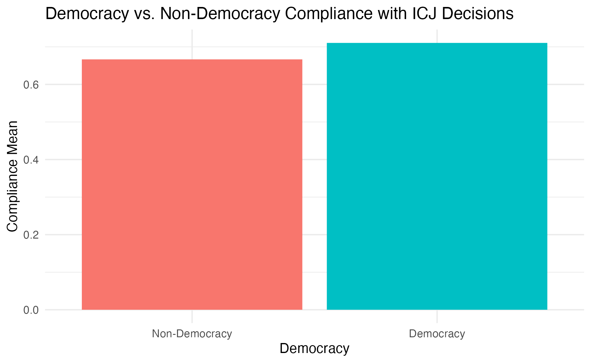

## Project thoughts

I am interested in exploring data related to compliance with International Court of Justice decisions. I would like to determine whether a state's level of democracy, their government's ideology, or their aggregate power has a treatment effect on their willingness to comply with the Court's decisions. I will decide which of these treatment variables I would like to focus on based on the data I'm able to find.

## Research Proposal

Are democracies more likely to comply with international law? I hope to answer this research question by analyzing democratic states' compliance with International Court of Justice (ICJ) decisions. I hypothesize that democracies have a higher record of compliance than their autocratic counterparts. My hypothesis stems from the tendency of democracies to value justice and respect the rule of law more than autocracies. Democracies might also face more pressure to comply, as they have greater accountability to their publics through transparency. My sample is comprised of ICJ cases that have occurred from 1947 to 2018. My unit of analysis is an ICJ case. The explanatory variable of interest is whether a state is a democracy or an autocracy according to their Polity score. The variable is coded = 1 for democracies (+6 to +10) and =0 for anocracies and autocracies (-10 to +5). For the purposes of this study, anocracies will be coded as autocracies. My outcome variable is a state's compliance rate. This variable is measured from Tom Ginsburg's data on ICJ compliance found in the Comparative Constitutions Project's dataset. I will calculate the compliance rate of states by dividing the number of times they have complied with an ICJ judgement by the number of times they have been required them to comply to a ruling. I would find support for my hypothesis if I observe a greater compliance rate by democracies and a positive coefficient when I run my regression of the compliance rate on the democracy variable. If I find that there is a negative or no relationship between these two variables, I will have to re-evaluate my hypothesis.

## Data Visualizations

```{r Data Visualization 1: Democracy vs. Non-Democracy}
library(tidyverse)
library(ggplot2)
icj_comp <- read_csv("icjcompliance2.csv")
icj_comp

## democracy vs. non-democracy barplot
comp_mean_dem <- icj_comp |>
  drop_na() |>
    mutate(
    democracy = if_else(`Time-Varying Polity Score` >= 6, 1, 0)) |>
  group_by(democracy) |>
  summarize(comp_mean =  mean(Compliance, na.rm = TRUE)) 
comp_mean_dem

comp_mean_plot <- ggplot(comp_mean_dem, 
       mapping = aes(
      x = factor(democracy),
      y = comp_mean,
      fill = factor(democracy))) +
  geom_col() +
  theme_minimal() +
  labs(x = "Democracy",
       y = "Compliance Mean",
       title = "Democracy vs. Non-Democracy Compliance with ICJ Decisions") +
  scale_x_discrete(labels = c("Non-Democracy", "Democracy")) +
  theme(legend.position = "none")
comp_mean_plot

ggsave("comp_mean_plot.png")
```

```{r Data Visualization 2: Polity Score Breakdown }
comp_pol <- icj_comp |>
  drop_na() |>
    mutate(
    level_of_dem = case_when(
      `Time-Varying Polity Score` == 10 ~ "Full Democracy",
      `Time-Varying Polity Score` < 10 & `Time-Varying Polity Score` >= 6 ~ "Democracy",
      `Time-Varying Polity Score` < 6 & `Time-Varying Polity Score` >= 1 ~ "Open Anocracy",
      `Time-Varying Polity Score` < 1 & `Time-Varying Polity Score` >= -5 ~ "Closed Anocracy",
      `Time-Varying Polity Score` < -5 & `Time-Varying Polity Score` >= -10 ~ "Autocracy",
    )) |>
  group_by(level_of_dem) |>
  summarize(comp_mean =  mean(Compliance, na.rm = TRUE)) 

comp_pol_plot <- comp_pol |>
  ggplot(aes(x = comp_mean,
         y = fct_reorder(level_of_dem, comp_mean),
         fill = level_of_dem)) +
  geom_col() +
  theme_minimal() +
  labs(x = "Average Compliance with ICJ Decisions",
       y = "Regime Types") +
  theme(legend.position = "none")
comp_pol_plot
```

```{r Scatterplot: Relationship between Democracy and Compliance}
icj_comp_bin <- icj_comp |>
  drop_na() |>
    mutate(
    democracy = if_else(`Time-Varying Polity Score` >= 6, 1, 0),
    compliance = if_else(Compliance == 1, "Compliance", "Non-compliance"))

comp_mean_plot2 <- ggplot(icj_comp_bin, 
       mapping = aes(
      x = democracy,
      y = Compliance, alpha = 0.2)) +
  geom_point() +
    geom_jitter(width = 0.03, height = 0.03)
comp_mean_plot2
```


```{r Visual Summary of Dependent Variable}
dem_comp_plot <- icj_comp_bin |>
  ggplot(aes(x = as.factor(democracy),
             fill = as.factor(democracy))) +
  geom_bar(binwidth = 1) +
  scale_x_discrete(labels = c("Non-Democracy", "Democracy")) +
  labs(x = "",
       y = "Count") +
  facet_wrap(~ compliance) +
  theme_minimal() +
  theme(legend.position = "none")
dem_comp_plot
```


## Results and Analysis

```{r}
library(broom)
fit1 <- lm(comp_mean ~ democracy, data = comp_mean_dem)
fit1

fit1 |>
  broom::tidy() |>
  dplyr::select(term, estimate) |>
  knitr::kable(caption = "Coefficient Estimates for a Model Fitted to Estimate Variation in Compliance")

summary(fit1)

fit2 <- glm(Compliance ~ `Time-Varying Polity Score`, data = icj_comp_bin, family = binomial())
fit2
summary(fit2)

fit2 |>
  broom::tidy() |>
  knitr::kable(caption = "Coefficient Estimates for a Model Fitted to Estimate Variation in Compliance", digits = c(0,2,3,2,3), col.names = c("Predictor", "Estimate", "Std. Error", "Statistic", "P-value"))

fit3 <- glm(Compliance ~ `Time-Varying Polity Score` + `Judgement Year`, data = icj_comp_bin, family = binomial())
fit3
summary(fit3)

fit3 |>
  tidy() |>
  knitr::kable(caption = "Coefficient Estimates for a Model Fitted to Estimate Variation in Compliance",
        col.names = c("Predictor", "Estimate", "Std. Error", "Statistic", "P-value"))
```

```{r Visualization of Logistic Regression}
ggplot(icj_comp_bin, aes(x=`Time-Varying Polity Score`, y=Compliance)) + 
  geom_point(alpha=.5) +
  stat_smooth(method="glm", se=FALSE, method.args = list(family=binomial))
```

According to the `Time-Varying Polity Score` coefficient estimate, democracies comply slightly more with International Court of Justice (ICJ) decisions than non-democracies. Controlling for the year in which the judgement was released, a country is supposedly 1.7% more likely to comply with an ICJ decision with an increase in its Polity Score. However, no causal relationship can be proved as the P-value is higher than 0.5 and, therefore, not statistically significant. 


## Notes

linear regression - uses likelihood estimate of normal regression
binomial distribution = 

normal distribution = continuous
OLS - solves when dependent varaible is normal

The data type is time series cross-sectional (tscs) or panel data. For the purposes of simplicity and staying within the scope of this class, I will be assuming that my research design is cross-sectional. 


year in second explanatory variable - controlling for year variable - 


p-value - statistical significance - main coefficeint 
summary(m2.lm)

three stars = statistically significant, testing how extreme test estimate is in world of null hypothesis (estimate = 0) - coefficient = 0 (no effect)


scatterplot idea"

comp_mean_plot2 <- ggplot(icj_comp, 
       mapping = aes(
      x = Compliance,
      y = `Time-Varying Polity Score`)) +
  geom_point() +
  geom_jitter(width = 10, height = 20) +
  xlim(0,1)
comp_mean_plot2

---

fit2 <- lm(`Time-Varying Polity Score` ~ Compliance, data = icj_comp_bin)
fit2
summary(fit2)
# include a linear regression with a continuous variable (Polity Score)


## Sources
<https://www.systemicpeace.org/polity/polity4x.htm> <http://www.systemicpeace.org/inscrdata.html> - <https://www.ifo.de/DocDL/dice-report-2019-3-hainz_moffet_rhode-october_0.pdf>

